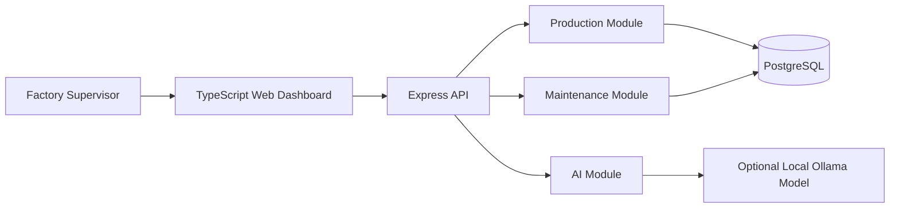

# IndustryOps AI

IndustryOps AI is a full-stack TypeScript factory operations application built as a modular monolith. It uses Express for the API, PostgreSQL for persistence, Docker for infrastructure, and an optional local Ollama model for AI-generated shift insight.

The product story is intentionally industrial: production lines, shift production logs, scrap, downtime, quality inspections, maintenance tickets, operational alerts, audit trail, and supervisor-friendly summaries. That makes it a stronger portfolio project for manufacturing employers than a generic CRUD demo.

## What It Demonstrates

- Modular monolith backend design with clear business boundaries.
- TypeScript across backend and frontend.
- Express API with validation, error handling, structured logging, and health checks.
- PostgreSQL infrastructure with Docker Compose.
- Optional local AI integration that can run without sending factory data to an external API.
- Production-oriented documentation, architecture diagrams, and deployment notes.
- Shift logging with good units, scrap units, downtime, availability, and throughput KPIs.
- Quality inspection records with failed and blocked containment signals.
- Operational alerts derived from production, quality, and maintenance risk.
- Audit trail for important operational changes.

## Architecture



The application is one deployable service. The modules are separated in code, but they run in the same process. This keeps deployment simple while still showing professional boundaries between business capabilities.

## Quick Start

```bash
npm install
cp .env.example .env
docker compose up -d postgres
npm run db:migrate
npm run dev:api
```

In another terminal:

```bash
npm run dev:web
```

Open:

- Web dashboard: `http://localhost:5173`
- API health check: `http://localhost:4000/health`

PostgreSQL is exposed on host port `15432` by default to avoid conflicts with local PostgreSQL services on common ports like `5432` or `5433`.

## How To Use The App

The dashboard is now interactive:

1. Use **Add production line** to create a new factory line.
2. Use **Log shift output** to record planned minutes, good units, scrap units, downtime, and downtime reason.
3. Use **Record quality inspection** to capture sample size, defects, severity, and containment status.
4. Use **Create maintenance ticket** to open a ticket for one of the lines.
5. Use the **Change status** dropdowns on production lines and tickets to simulate operations.
6. Review KPI cards, alert cards, quality history, and audit trail.
7. Click **Generate AI insight** to summarize current line, production, downtime, quality, alert, and maintenance risk.

The AI button does not require Ollama to be running. If `AI_ENABLED=false`, the backend returns a rules-based fallback so the workflow still works.

## Docker Run

Build and run the app with PostgreSQL:

```bash
docker compose up --build
```

Open `http://localhost:4000`.

Compose runs the compiled migration before starting the API so the demo environment is ready without a separate migration command.

## Optional Local AI

Start Ollama with the AI profile:

```bash
AI_ENABLED=true docker compose --profile ai up --build app ollama ollama-pull
```

The `ollama-pull` helper pulls the configured model, defaulting to `tinyllama`. If you want to pull manually:

```bash
docker exec -it industry-ops-ollama ollama pull tinyllama
```

Set `AI_ENABLED=true` in `.env` for local development. If Ollama is disabled or unavailable, the app returns a deterministic rules-based insight instead of failing the user workflow.

## Scripts

| Command | Purpose |
| --- | --- |
| `npm run dev:api` | Start the Express API in watch mode |
| `npm run dev:web` | Start the Vite frontend |
| `npm run db:migrate` | Create database tables and seed demo records |
| `npm run build` | Build backend and frontend into `dist/` |
| `npm start` | Run the production build |
| `npm test` | Run unit tests |
| `npm run typecheck` | Type-check backend and frontend |

## API Surface

| Method | Path | Description |
| --- | --- | --- |
| `GET` | `/health` | API and database health |
| `GET` | `/api/alerts` | Derived operational alerts |
| `GET` | `/api/audit-events` | Recent operational audit events |
| `GET` | `/api/production-lines` | List production lines |
| `POST` | `/api/production-lines` | Create a production line |
| `PATCH` | `/api/production-lines/:id/status` | Change line status |
| `GET` | `/api/production-events` | List recent shift production logs |
| `POST` | `/api/production-events` | Log shift output, scrap, and downtime |
| `GET` | `/api/production-events/summary` | Get production KPI summary |
| `GET` | `/api/quality-inspections` | List recent quality inspections |
| `POST` | `/api/quality-inspections` | Record quality inspection result |
| `GET` | `/api/quality-inspections/summary` | Get quality KPI summary |
| `GET` | `/api/maintenance-tickets` | List maintenance tickets |
| `POST` | `/api/maintenance-tickets` | Create a maintenance ticket |
| `PATCH` | `/api/maintenance-tickets/:id/status` | Change ticket status |
| `GET` | `/api/ai/status` | Check whether Ollama/model is available |
| `POST` | `/api/ai/factory-insight` | Generate shift insight from current factory data |

## Documentation

- [Architecture](docs/ARCHITECTURE.md)
- [API Reference](docs/API.md)
- [AI Integration](docs/AI.md)
- [Deployment](docs/DEPLOYMENT.md)
- [Production Readiness](docs/PRODUCTION_READINESS.md)
- [How The App Works](docs/HOW_IT_WORKS.md)
- [User Stories](docs/USER_STORIES.md)

## Engineering Notes

This project is not designed as microservices. For this stage, a modular monolith is the better engineering choice: easier local development, easier deployment, one database transaction boundary, and less operational complexity. If the app grows, modules can later be extracted based on real pressure instead of speculative architecture.
