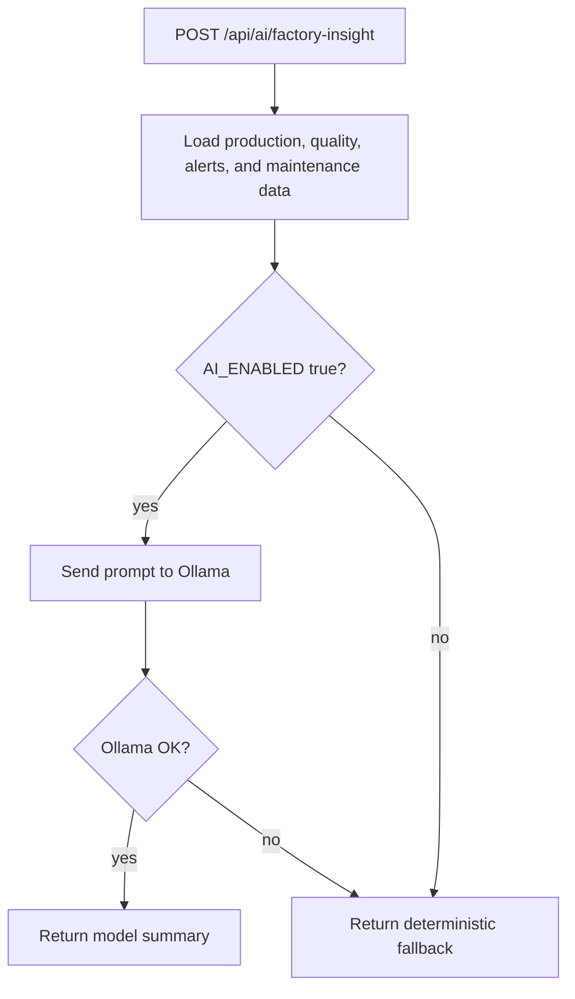

# Local AI Integration

## Purpose

The AI feature summarizes current factory data into a shift insight for a supervisor. It includes production, downtime, maintenance, quality, and alert context. It is intentionally scoped to advice and prioritization. It should not automatically stop lines, close tickets, release blocked quality batches, or make safety decisions.

## Provider

The app integrates with Ollama through HTTP:

```text
POST /api/generate
```

Default model:

```text
tinyllama
```

The model is small compared with stronger hosted LLMs, but the Ollama Docker image itself can still pull a multi-GB runtime layer depending on platform. For better quality later, you can switch `OLLAMA_MODEL` to a stronger model without changing application code.

## Runtime Behavior



## Why Local AI

For factory contexts, local AI has two practical advantages:

- Demo environments do not require external API keys.
- Sensitive operational data does not leave the local network during the demo.

The trade-off is weaker output quality compared with larger hosted models. That is acceptable here because the AI feature is advisory and the fallback still keeps the workflow usable.

## AI Status

```bash
curl http://localhost:4000/api/ai/status
```

If `AI_ENABLED=false`, the app reports the deterministic fallback as available. If `AI_ENABLED=true`, the app checks whether Ollama is reachable and whether the configured model is pulled.

## Running With Ollama

```bash
AI_ENABLED=true docker compose --profile ai up --build app ollama ollama-pull
```

If the image pull is too heavy for your machine, use the app with `AI_ENABLED=false`; the rules-based fallback still summarizes live operational risk and keeps the workflow usable.

Then call:

```bash
curl -X POST http://localhost:4000/api/ai/factory-insight
```

## Production Caution

Before using this in a real plant, add:

- Authentication and authorization.
- Prompt and response logging with sensitive data controls.
- Human approval for any operational action.
- Clear disclaimer that AI output is advisory.
- Monitoring for model latency and failure rates.
