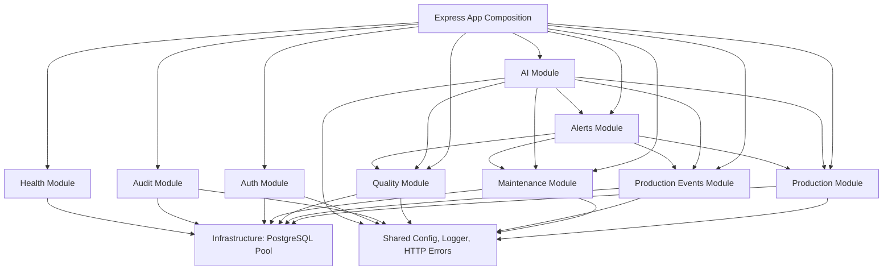
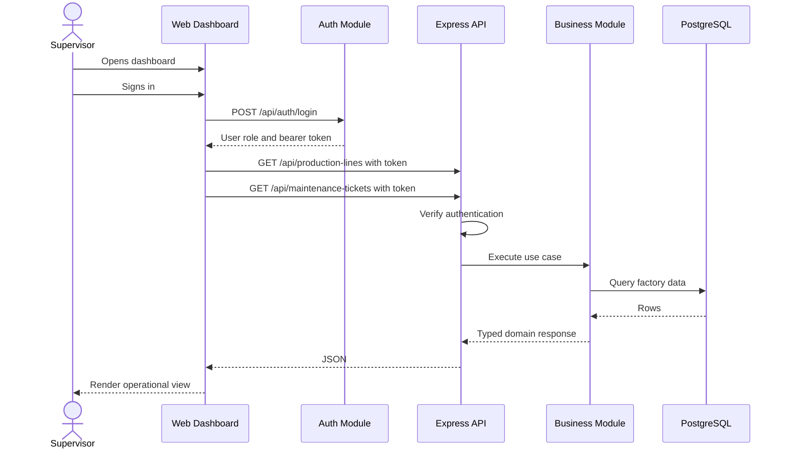
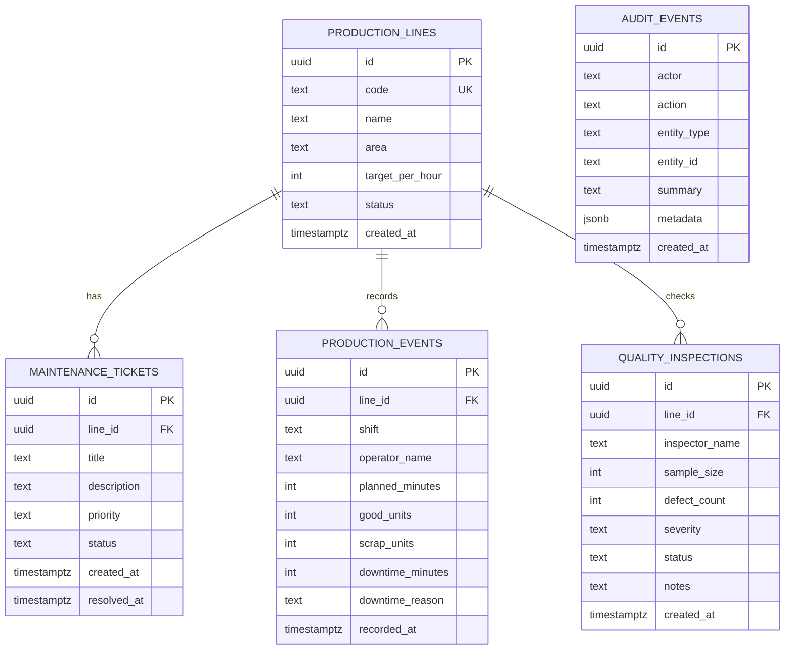

# Architecture

## Goal

IndustryOps AI gives a factory supervisor a compact view of production line status, shift output, scrap, downtime, quality containment, active maintenance risk, audit trail, operational alerts, and a generated shift insight. The project is designed to look and behave like an early production system, not a tutorial CRUD app.

## Architectural Style

The app is a modular monolith:

- One deployable Node.js process.
- One PostgreSQL database.
- Business capabilities split into modules.
- Shared infrastructure kept outside business modules.
- Optional local AI kept behind a dedicated module.

This is a good fit for an early industrial application because the domain is still evolving. A microservice design would add networking, deployment, observability, and data consistency complexity before the product has proven it needs that complexity.

## Module Boundaries



## Request Flow



## Folder Structure

```text
src/
  app.ts                    Express app composition
  server.ts                 Process entry point
  infra/
    database/               PostgreSQL connection and migration
  modules/
    ai/                     Local AI insight capability
    alerts/                 Derived operational alert capability
    auth/                   Sign-in, token verification, and role checks
    audit/                  Operational audit trail
    health/                 Health checks
    maintenance/            Maintenance ticket capability
    quality/                Quality inspection capability
    production-events/      Shift production logging and KPI capability
    production/             Production line capability
  shared/
    config/                 Environment parsing
    http/                   Error and async route helpers
    logger/                 Structured logging
web/
  src/                      TypeScript frontend
docs/                       Engineering documentation
```

## Data Model



## Why These Choices

Express is simple, stable, and widely understood. TypeScript adds compile-time safety around request validation, domain types, and module contracts. PostgreSQL is a realistic default for industrial operations data because relational integrity matters. Docker Compose gives a reproducible local environment without pretending this needs Kubernetes on day one.

## Known Limitations

- Authentication and role-based authorization are implemented for demo/staging use, but not yet enterprise SSO or full user administration.
- Database migrations are intentionally simple and not versioned.
- The frontend is intentionally lightweight and does not use a component framework.
- AI output is advisory only and must not be treated as an automated production decision.
- Production and quality events are manually entered; there is no PLC, MES, ERP, barcode, or machine sensor integration yet.
- Alerts are derived on request and do not yet support assignment, acknowledgement, or escalation.

## Next Engineering Milestones

1. Add admin user management and production-grade identity hardening.
2. Replace the simple migration script with versioned migrations.
3. Replace derived-only alerts with assignable alerts and acknowledgement workflow.
4. Add line-level KPI filters by date range and shift.
5. Add integration tests using a real PostgreSQL test container.
6. Add deployment pipeline and environment-specific configuration.
  APP_USERS {
    uuid id PK
    text name
    text email UK
    text role
    text password_hash
    timestamptz created_at
  }
