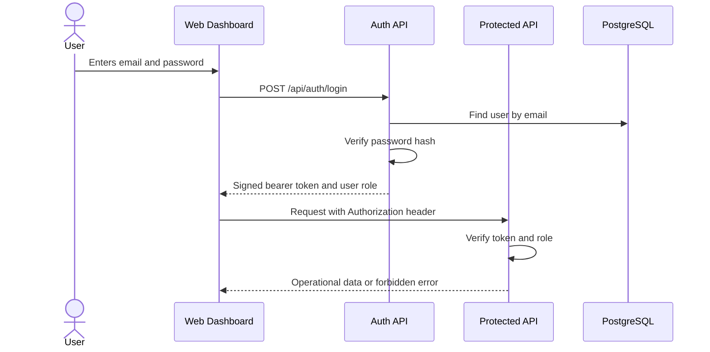

# Authentication And Roles

## What Is Implemented

IndustryOps AI includes demo authentication suitable for local development, portfolio review, and staging-style demos.

The backend stores users in `app_users` with:

- Name
- Email
- Role
- PBKDF2 password hash
- Created timestamp

After login, the API returns a signed bearer token. The frontend stores that token in `localStorage` and sends it as:

```http
Authorization: Bearer <token>
```

All `/api/*` routes require authentication except:

- `POST /api/auth/login`
- `GET /health`

## Demo Users

All demo users use password `IndustryOps123!`.

| Role | Email | Main purpose |
| --- | --- | --- |
| `admin` | `admin@industryops.local` | Full operational access |
| `supervisor` | `supervisor@industryops.local` | Manage lines, log operations, inspect factory status |
| `line_leader` | `line.leader@industryops.local` | Log production output and create maintenance tickets |
| `quality` | `quality@industryops.local` | Record quality inspections |
| `maintenance` | `maintenance@industryops.local` | Create and update maintenance tickets |
| `viewer` | `viewer@industryops.local` | Read-only dashboard access |

## Authorization Rules

| Action | Allowed roles |
| --- | --- |
| Read dashboard data | All authenticated roles |
| Create production line | `admin`, `supervisor` |
| Change production line status | `admin`, `supervisor` |
| Log shift output | `admin`, `supervisor`, `line_leader` |
| Record quality inspection | `admin`, `supervisor`, `quality` |
| Create maintenance ticket | `admin`, `supervisor`, `line_leader`, `maintenance` |
| Update maintenance ticket status | `admin`, `supervisor`, `maintenance` |
| Generate AI insight | All authenticated roles |

The UI hides or locks write forms when the current role cannot perform that action. The API also enforces the same rules, which is the important security boundary.

## Request Flow



The diagram shows the key production idea: the frontend can improve the user experience, but the backend must make the final permission decision.

## Production Hardening Still Needed

This is intentionally a demo-grade identity system. Before a real factory deployment, improve it:

- Use Argon2id or bcrypt with reviewed password policy.
- Prefer HTTP-only secure cookies or a short-lived access token plus refresh-token rotation.
- Add account lockout and rate limiting for login attempts.
- Add user management screens for admins.
- Move `AUTH_TOKEN_SECRET` to a production secret manager.
- Add password reset, disable-user, and audit events for admin identity changes.
- Consider SSO or company identity provider integration if the client already uses one.

The current implementation is valuable because it proves the role model and protects demo APIs. It is not a replacement for enterprise identity management.
