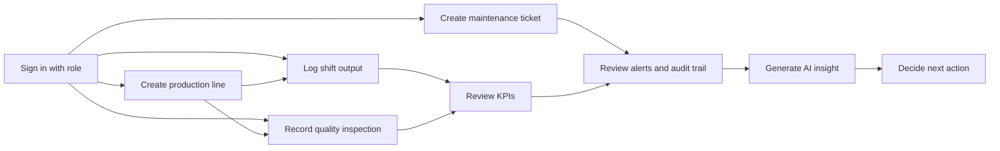
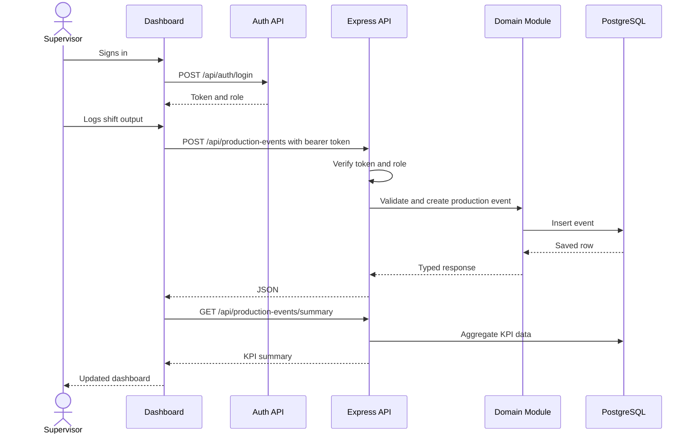

# How The App Works

## Product Purpose

IndustryOps AI is a small factory operations cockpit. It helps a supervisor answer four practical questions:

1. Which production lines are running, paused, or under maintenance?
2. What was produced during recent shifts?
3. Where are scrap and downtime creating operational risk?
4. Which quality or maintenance issue should be handled first?
5. Is the local AI model actually available?
6. Which actions is the signed-in role allowed to perform?

The app is not an MES replacement yet. It is an early modular monolith that demonstrates the core workflow an industrial operations tool would need before connecting to PLCs, barcode scanners, ERP, or a real MES.

## Main Workflow

## What Each Area Does

### Authentication And Roles

Users sign in before the dashboard loads operational APIs. The backend returns a signed bearer token and the UI uses the current role to show or lock write forms.

The backend still enforces permissions. This matters because browser controls can be bypassed. A viewer can inspect the dashboard, but cannot create production records through the API.

Main roles:

- Admin and supervisor manage production lines.
- Line leaders log shift output.
- Quality users record inspections.
- Maintenance users create and update maintenance tickets.
- Viewers have read-only access.

### Production Lines

A production line is a factory resource such as a wire-harness assembly line, cable cutting cell, or quality gate.

Stored fields:

- Code
- Name
- Area
- Target output per hour
- Current status

The status helps supervisors quickly distinguish normal operation from stoppage or planned maintenance.

### Shift Production Logs

A production event records what happened during a shift for one line.

Stored fields:

- Production line
- Shift
- Operator or team leader
- Planned minutes
- Good units
- Scrap units
- Downtime minutes
- Downtime reason

This is the feature that makes the app more realistic. In a factory, line status alone is not enough. Supervisors need output, scrap, downtime, and reasons.

### Maintenance Tickets

Maintenance tickets track technical issues that affect production or quality.

Stored fields:

- Production line
- Title
- Description
- Priority
- Status

This connects production performance with technical action. For example, high scrap on a quality gate and an open sensor ticket together create a stronger operational signal than either one alone.

### Quality Inspections

Quality inspections record sample checks and containment status.

Stored fields:

- Production line
- Inspector
- Sample size
- Defect count
- Severity
- Status: passed, failed, or blocked
- Notes

This is important in a real manufacturing environment because production volume without quality control is not enough. A line can produce many units while still creating customer risk.

### Operational Alerts

Alerts are derived from current operational data:

- Paused or maintenance lines
- High scrap rate
- Low availability
- Failed or blocked quality inspections
- Critical maintenance tickets

The current implementation computes alerts on demand. This is simpler than storing alert state and is good enough for a first production-style demo.

### Audit Trail

The audit trail records important operational actions:

- Creating production lines
- Changing line status
- Logging shift output
- Creating or updating maintenance tickets
- Recording quality inspections

In a real plant, audit history matters because supervisors and quality teams need to understand who changed what and when.

### KPI Summary

The app calculates KPIs from production logs:

- Good units
- Scrap units
- Scrap rate
- Planned minutes
- Downtime minutes
- Availability
- Average units per hour

These metrics are intentionally simple. They are useful for a demo and easy to explain in an interview. In a real plant, the next step would be date filters, line-level drilldowns, and shift comparisons.

### AI Insight

The AI endpoint builds a factory snapshot from:

- Production lines
- Production events
- KPI summary
- Quality inspections
- Operational alerts
- Maintenance tickets

If Ollama is enabled, it sends that snapshot to the local model. If AI is disabled or unavailable, it returns a deterministic rules-based insight. This is deliberate: the app should not fail just because local AI is not running.

The `/api/ai/status` endpoint tells the dashboard whether Ollama and the selected model are available.

## Request Flow

## Why This Design Is Realistic

The app uses a modular monolith because this is the correct starting point for most early internal tools:

- One deployable app is easier to run.
- One database keeps reporting simple.
- Modules still keep business logic organized.
- Features can later be extracted only if real scale or team boundaries require it.

The important engineering lesson: modular monolith does not mean messy monolith. The code still has boundaries for production, production events, maintenance, AI, infrastructure, and shared HTTP behavior.

## Current Limitations

- Authentication is implemented for demo/staging use, but not yet enterprise-grade SSO or full user administration.
- No audit history for every edit.
- No date filtering on KPI summaries yet.
- No machine integration.
- No export to CSV/PDF.
- No line-level charts yet.
- No approval workflow for blocked quality inspections yet.

Those are good next milestones because they solve real production problems rather than adding complexity for its own sake.
